# SGHSC — Guia de Uso

Guia passo a passo de todas as funcionalidades do Sistema de Gestão Hospitalar
para Santas Casas. Organizado por módulo, na ordem natural de uso do sistema.

> **Como o sistema se organiza:** a barra de navegação superior agrupa os módulos
> em menus: **Pacientes**, **Emergência**, **Ambulatório**, **Internação**,
> **Apoio Clínico**, **Administrativo** e **Gestão**. O botão com o nome do usuário
> (canto direito) dá acesso à troca de senha e logout.

---

## Índice

1. [Primeiro acesso e login](#1-primeiro-acesso-e-login)
2. [Dashboard](#2-dashboard)
3. [Pacientes](#3-pacientes)
4. [Emergência / Pronto-Atendimento](#4-emergência--pronto-atendimento)
5. [Ambulatório](#5-ambulatório)
6. [Internação](#6-internação)
7. [Certificação Digital](#7-certificação-digital)
8. [Exames](#8-exames)
9. [Farmácia](#9-farmácia)
10. [Nutrição](#10-nutrição)
11. [CCIH — Controle de Infecção](#11-ccih--controle-de-infecção)
12. [Centro Cirúrgico](#12-centro-cirúrgico)
13. [Maternidade](#13-maternidade)
14. [Administrativo](#14-administrativo)
15. [Gestão e Compliance](#15-gestão-e-compliance)

---

## 1. Primeiro acesso e login

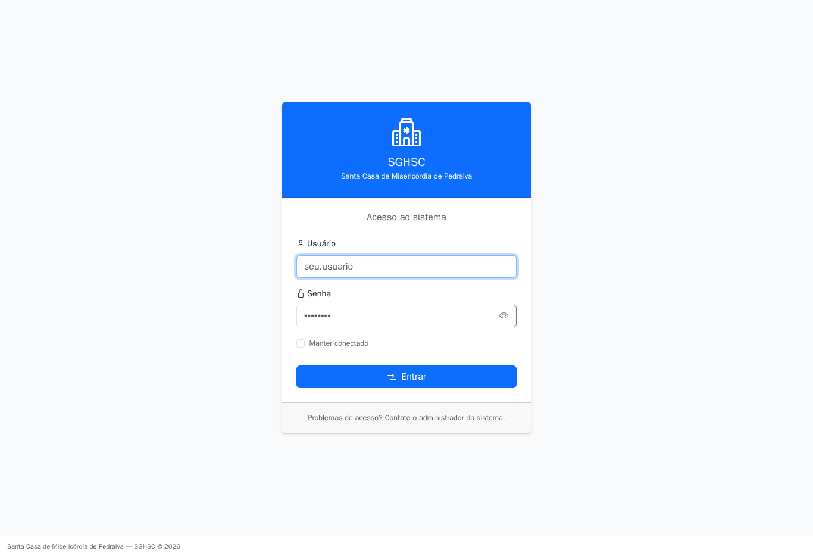

1. Acesse `http://localhost` (ou o endereço do servidor da instituição).
2. Informe **usuário** e **senha**. No primeiro acesso do administrador:
   - Usuário: `admin`
   - Senha: `Admin@123`
3. O sistema **obriga a troca da senha** no primeiro acesso. Escolha uma senha forte.
4. Após 5 tentativas de login inválidas, a conta é bloqueada por 30 minutos (proteção contra ataques).

**Trocar a senha depois:** clique no seu nome (canto superior direito) → *Alterar senha*.

---

## 2. Dashboard

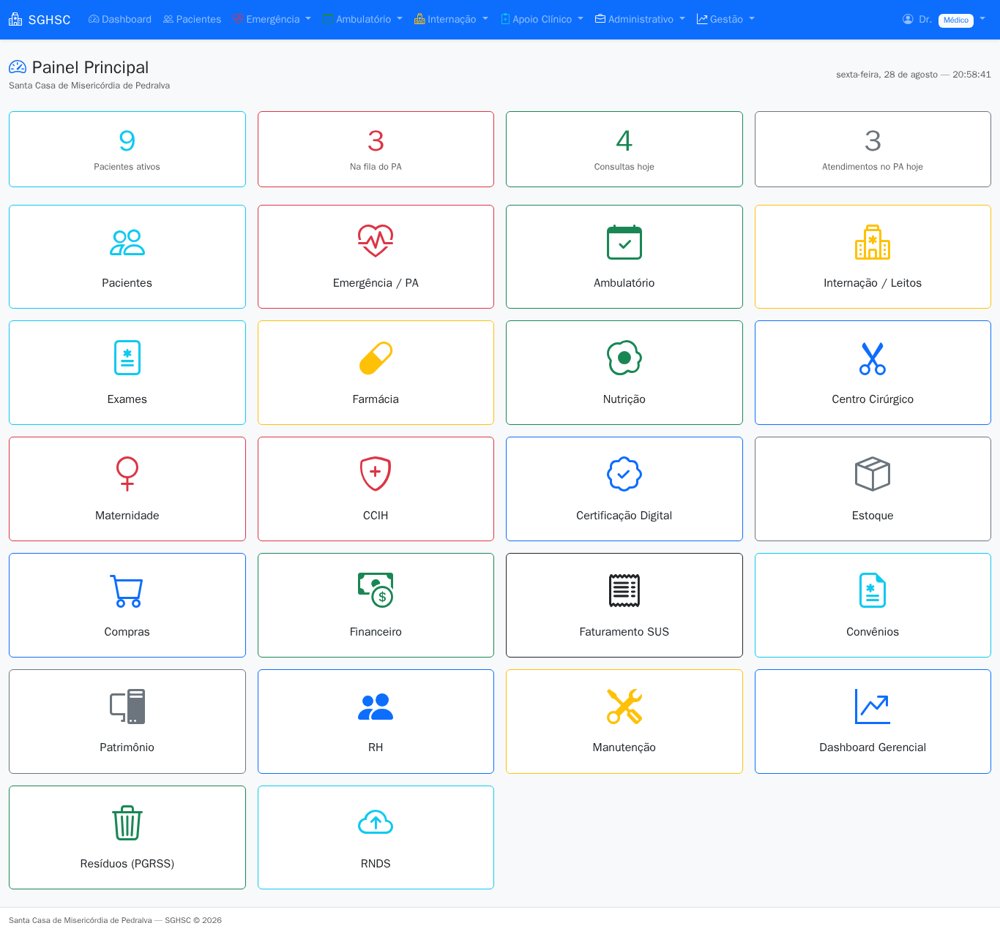

A tela inicial mostra:
- **Contadores em tempo real** (atualizam sozinhos): total de pacientes, fila do PA, consultas do dia, atendimentos do dia.
- **Cards de acesso rápido** a cada módulo. Clique no card para entrar no módulo.

---

## 3. Pacientes

O cadastro de pacientes é a base de todo o sistema — quase tudo se vincula a um paciente.

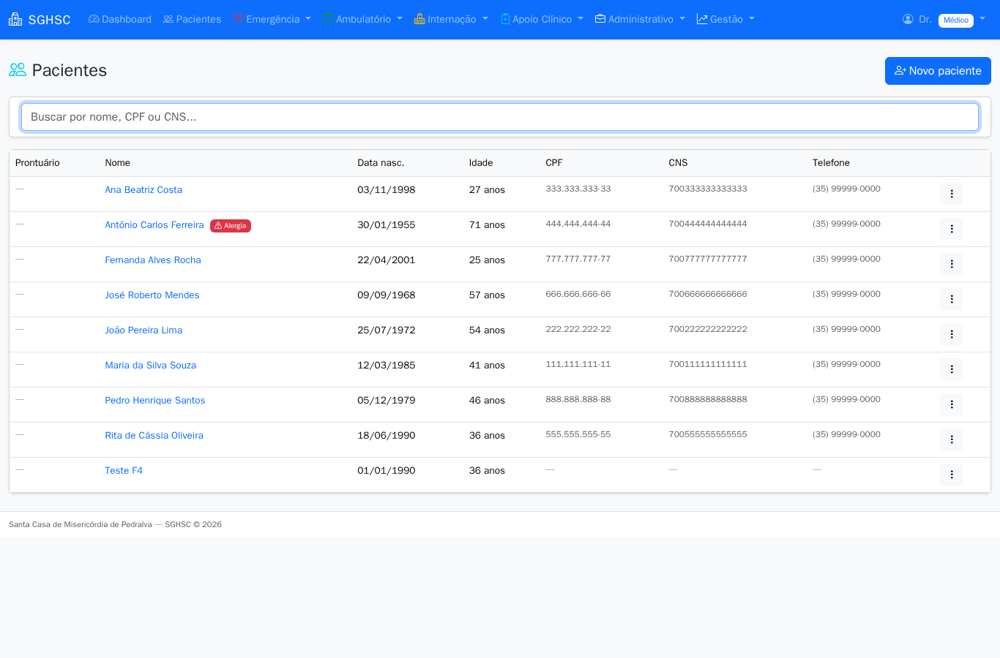

### Cadastrar um paciente
1. Menu **Pacientes** → botão **Novo paciente**.
2. Preencha os dados. Campos importantes:
   - **Nome, data de nascimento e sexo** são obrigatórios.
   - **CPF / CNS** (Cartão Nacional de Saúde) — usados na busca e no faturamento.
   - **CEP**: ao digitar, o endereço é preenchido automaticamente (integração ViaCEP).
   - **Alergias**: aparecem destacadas em vermelho no prontuário — preencha sempre que houver.
3. Clique em **Salvar**. Um prontuário é aberto automaticamente para o paciente.

### Buscar um paciente
- Menu **Pacientes** → digite nome, CPF ou CNS no campo de busca. Os resultados aparecem em tempo real (não precisa apertar Enter).

### Ver / editar
- Clique no nome do paciente na lista para ver os detalhes. Use o botão **Editar** para atualizar os dados.

---

## 4. Emergência / Pronto-Atendimento

Fluxo completo: **chegada → triagem → atendimento médico → saída**.

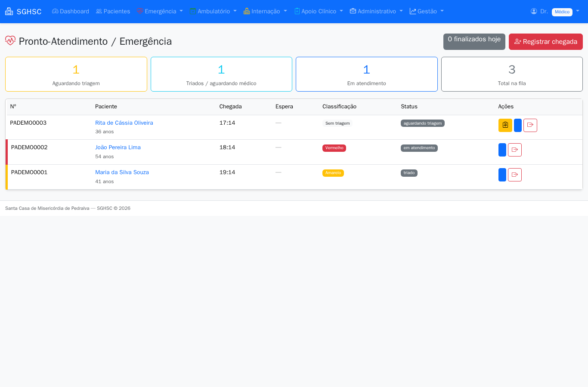

### Registrar a chegada
1. Menu **Emergência** → **Registrar chegada**.
2. Busque o paciente (por nome/CPF/CNS). Se não existir, use **Cadastrar novo paciente**.
3. Selecione o paciente e o modo de chegada. Confirme.
4. O paciente entra na **fila de espera**.

### Realizar a triagem (Protocolo Manchester)
1. Menu **Emergência** → **Fila de espera**.
2. Na linha do paciente, clique no botão de **triagem** (ícone de prancheta).
3. Registre os sinais vitais, a queixa e o discriminador.
4. Escolha a **cor de classificação** (vermelho → azul). A cor define a prioridade e aparece destacada na fila.

### Atendimento médico
1. Na fila, clique no botão de **atendimento** (ícone de estetoscópio).
2. Preencha anamnese, exame físico, hipótese diagnóstica, CID-10 e conduta.

### Registrar a saída
1. Na fila, clique no botão de **saída**.
2. Escolha o desfecho: alta, internação, transferência, óbito ou evasão.

> A fila atualiza automaticamente a cada 60 segundos.

---

## 5. Ambulatório

Fluxo: **configurar agenda → agendar consulta → atender**.

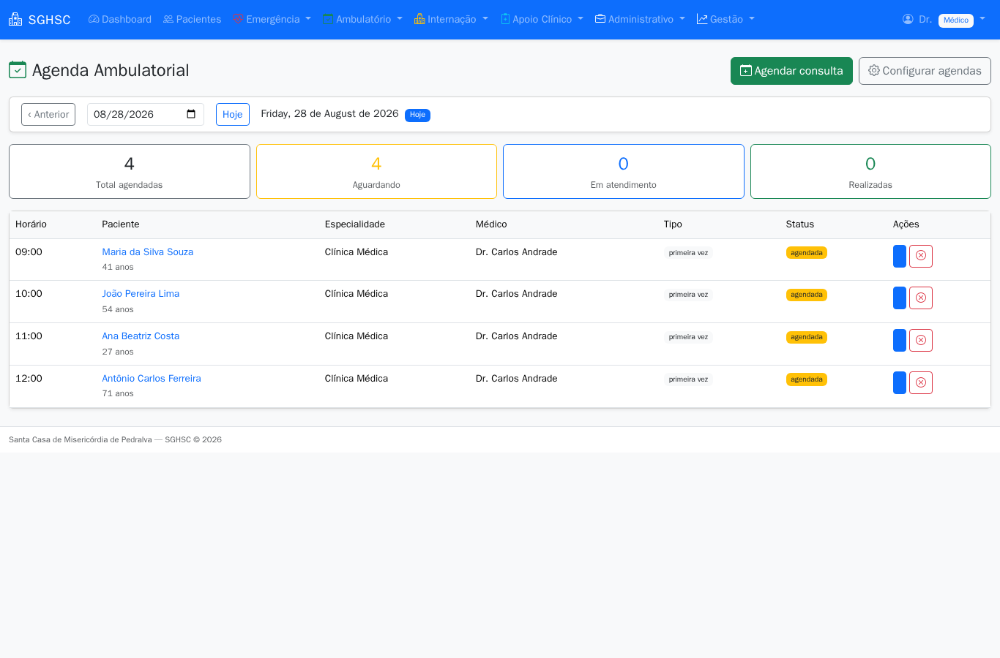

### Configurar a agenda de um médico
1. Menu **Ambulatório** → **Configurar agendas**.
2. Crie uma grade informando médico, especialidade, dia e horários.

### Agendar uma consulta
1. Menu **Ambulatório** → **Agendar consulta**.
2. Busque o paciente, escolha o médico, a data e o horário.
3. Confirme o agendamento.

### Atender
1. Menu **Ambulatório** → **Agenda do dia** (navegue pela data desejada).
2. Clique na consulta para abrir o atendimento.
3. Registre anamnese, exame, CID-10, prescrição e retorno. Finalize a consulta.

---

## 6. Internação

Fluxo: **cadastrar leitos → admitir → acompanhar (prescrição/evolução/controles) → alta**.

### Preparar os leitos (uma vez)
1. Menu **Internação** → **Cadastrar leito**.
2. Informe número, tipo (enfermaria, UTI, isolamento...), ala/andar. Marque **isolamento** se for leito de precaução (CCIH).

### Mapa de leitos
- Menu **Internação** → **Mapa de leitos**. Mostra todos os leitos coloridos por status (verde=livre, vermelho=ocupado, etc.), agrupados por ala. Atualiza a cada 60s.

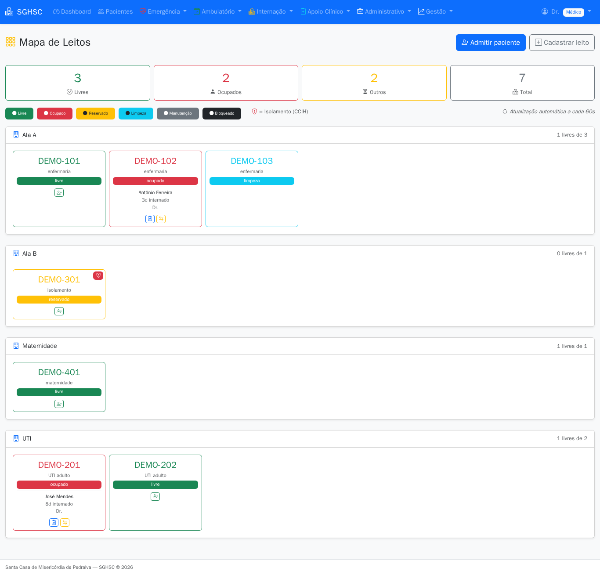

### Admitir um paciente
1. Menu **Internação** → **Admitir paciente** (ou clique em **admitir** num leito livre do mapa).
2. Busque o paciente, escolha o leito e o médico responsável.
3. Informe tipo de internação, motivo, CID-10 e convênio. Confirme.

### Acompanhar a internação (prontuário)
Abra o prontuário da internação (pelo mapa ou pela lista de internações ativas). Ele tem quatro abas:

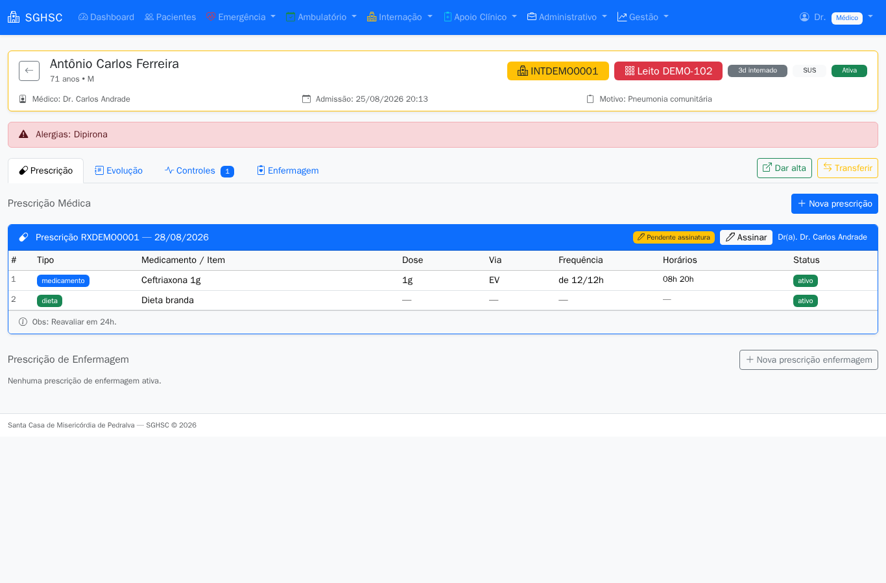

- **Prescrição** — clique em *Nova prescrição*. Adicione itens (medicamento, dieta, cuidado...) com dose, via e frequência. A nova prescrição copia os itens ativos da anterior, agilizando o dia a dia. Depois de salva, use **Assinar** para assinar digitalmente (ver seção 7).
- **Evolução** — registre a evolução médica (formato SOAP) e a de enfermagem (por turno). Cada evolução pode ser assinada digitalmente.
- **Controles** — registre sinais vitais e balanço hídrico. O balanço (entradas − saídas) é calculado em tempo real.
- **Enfermagem** — histórico e prescrição de enfermagem.

### Transferir de leito
- No prontuário, botão **Transferir**. Escolha o leito de destino. O leito antigo vai para *limpeza* e o novo para *ocupado* automaticamente.

### Dar alta
1. No prontuário, botão **Dar alta**.
2. Escolha o tipo de alta e a condição de saída, preencha o resumo e as orientações.
3. Ao confirmar, o sistema gera o **laudo de alta em PDF** e libera o leito.

---

## 7. Certificação Digital

Permite assinar documentos clínicos com validade jurídica (ICP-Brasil).

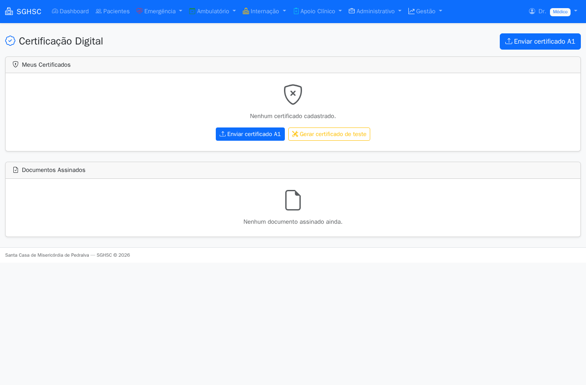

### Cadastrar seu certificado
1. Menu **Apoio Clínico** → **Certificação Digital**.
2. Botão **Enviar certificado A1** — envie o arquivo `.p12`/`.pfx` e informe a senha.
   - **Ainda não tem certificado?** Em ambiente de desenvolvimento, use **Gerar certificado de teste** (sem valor jurídico, apenas para experimentar o fluxo).

### Assinar um documento
- Nas telas de prescrição, evolução ou laudo, clique em **Assinar**. O sistema:
  1. Gera o PDF do documento.
  2. Assina com o seu certificado (aplica carimbo de tempo, se houver internet).
  3. Sela o documento — depois de assinado, **não pode mais ser alterado**.
  4. Gera um **QR Code** de validação.

### Validar um documento
- Qualquer pessoa pode conferir a autenticidade em **Certificação Digital → validar** (ou lendo o QR Code do documento), informando o código de validação. A página é pública, não exige login.

---

## 8. Exames

Fluxo: **solicitar → coletar → lançar resultado → (assinar laudo)**.

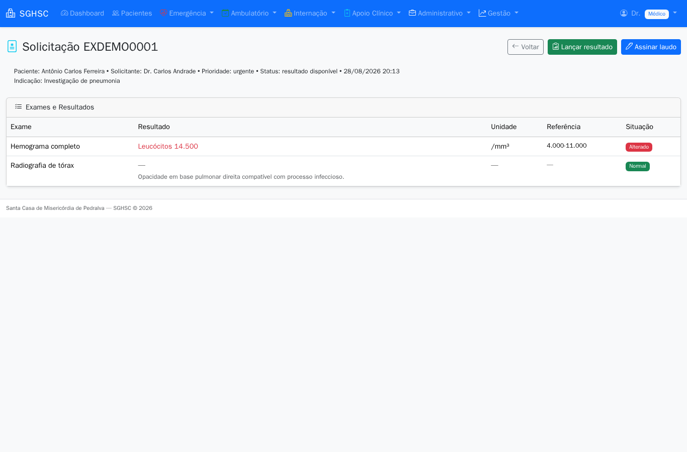

### Solicitar
1. Menu **Apoio Clínico** → **Exames** → **Solicitar exame**.
2. Busque o paciente, defina prioridade e adicione os exames (digite ou escolha do catálogo).

### Coletar (laboratório)
- Menu **Exames** → **Fila de coleta**. Clique em **coletar** quando o material for colhido.

### Lançar resultado
1. Na fila ou no detalhe da solicitação, clique em **Lançar resultado**.
2. Preencha os valores, unidades e valor de referência. Marque *alterado* quando fora do normal.
3. Opcional: **Assinar laudo** para selar o resultado com assinatura digital.

### Cadastrar exames no catálogo
- Menu **Exames** → **Catálogo** — cadastre os exames disponíveis na unidade.

---

## 9. Farmácia

Fluxo: **cadastrar medicamento → dar entrada no estoque → dispensar**.

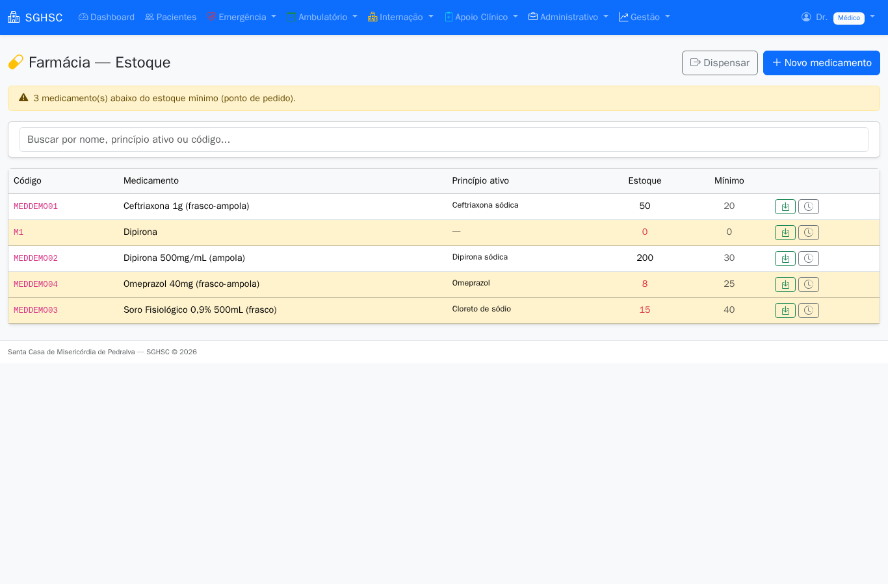

### Cadastrar medicamento
- Menu **Apoio Clínico** → **Farmácia** → **Novo medicamento**. Informe código, nome, concentração e estoque mínimo (ponto de pedido).

### Dar entrada no estoque
- Na lista, botão de **entrada** (ícone de caixa). Informe quantidade, lote, validade e fabricante.

### Dispensar por prescrição
1. Menu **Farmácia** → **Dispensar**.
2. Escolha a internação. O sistema mostra a prescrição médica ativa como referência.
3. Selecione os medicamentos e quantidades. Confirme. O estoque baixa automaticamente (o lote mais próximo do vencimento sai primeiro).

> Medicamentos abaixo do estoque mínimo aparecem destacados na lista de estoque.

---

## 10. Nutrição

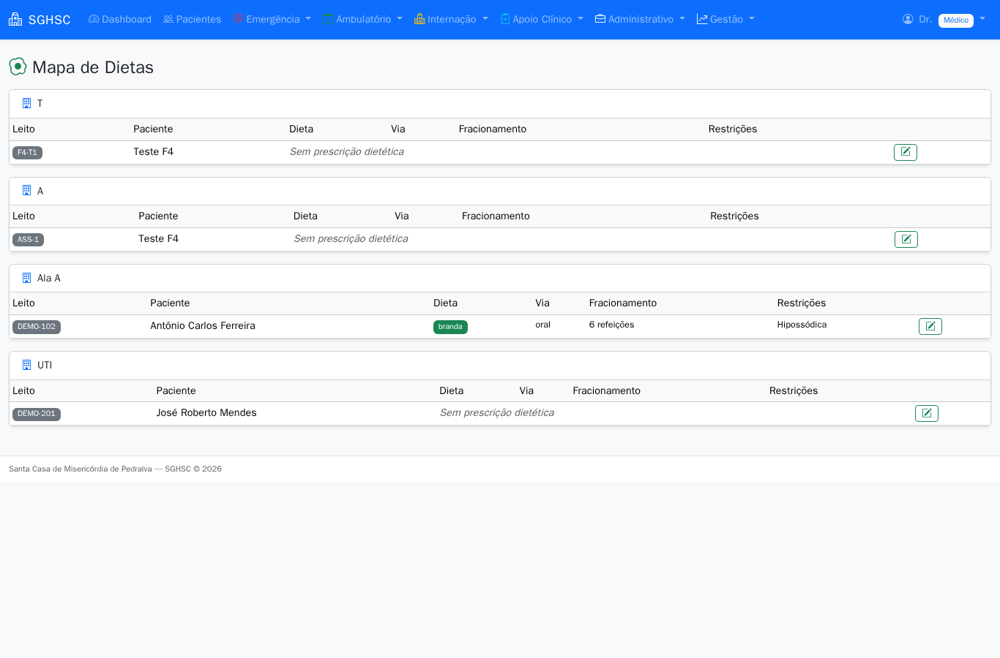

- Menu **Apoio Clínico** → **Nutrição** → **Mapa de dietas**: mostra os pacientes internados por ala e a dieta de cada um.
- Para prescrever, clique no ícone de edição na linha do paciente. Informe tipo de dieta, via, valor calórico, fracionamento e restrições.

---

## 11. CCIH — Controle de Infecção

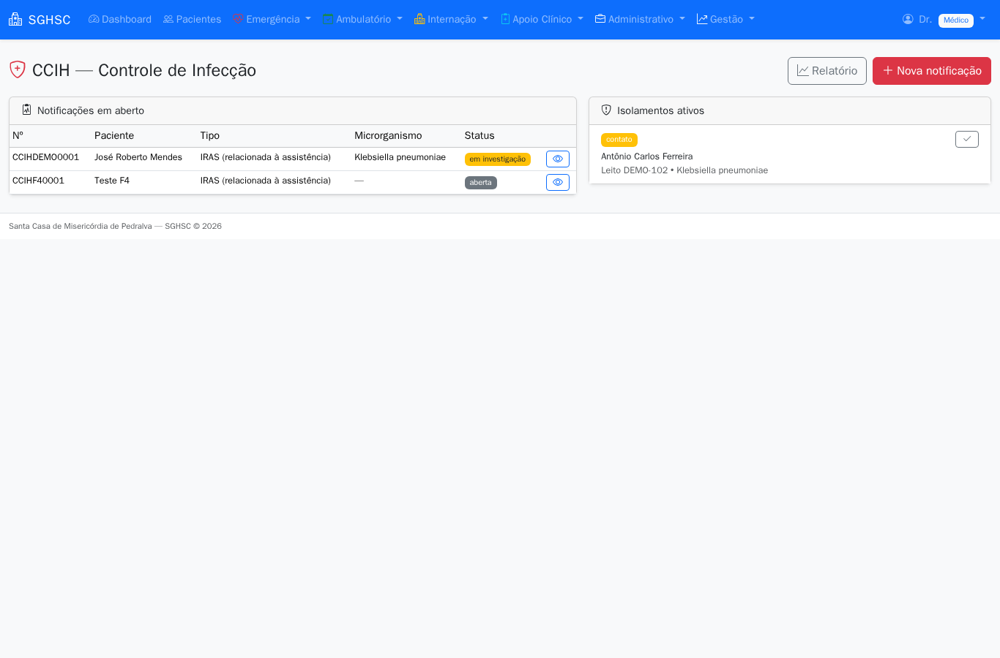

- Menu **Apoio Clínico** → **CCIH**.
- **Notificar infecção**: registre o caso (tipo, microrganismo, CID-10).
- **Painel**: acompanhe notificações em aberto e isolamentos ativos.
- **Iniciar isolamento**: marca o leito do paciente como isolamento no mapa de leitos.
- **Relatório**: totais para vigilância epidemiológica (base SCIRAS).

---

## 12. Centro Cirúrgico

Fluxo: **solicitar → agendar → executar (fluxo de sala) → descrever**.

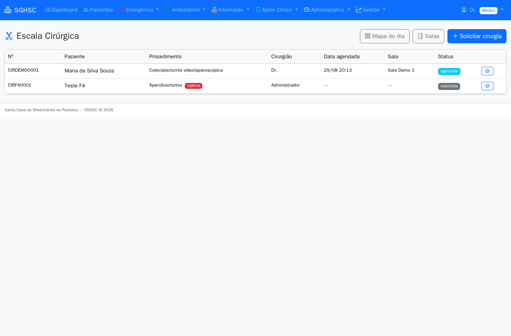

1. Menu **Apoio Clínico** → **Centro Cirúrgico**.
2. **Solicitar cirurgia**: paciente, procedimento, cirurgião, tipo, porte, anestesia.
3. **Agendar**: defina sala, data/hora e anestesista.
4. **Mapa do dia**: visão das cirurgias por sala.
5. Durante a cirurgia, use o seletor de **status** para registrar o fluxo (preparo → em andamento → recuperação → concluída); os horários são carimbados automaticamente.
6. **Descrição cirúrgica**: registre a nota de sala. Pode ser assinada digitalmente.

---

## 13. Maternidade

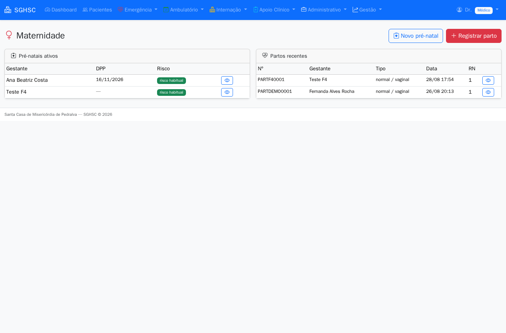

- Menu **Apoio Clínico** → **Maternidade**.
- **Pré-natal**: cadastre a gestante e registre as consultas de acompanhamento (IG, peso, PA, BCF...).
- **Registrar parto**: tipo de parto, data, e um ou mais **recém-nascidos** (sexo, peso, Apgar).

---

## 14. Administrativo

Acesse pelo menu **Administrativo**.

### Estoque / Almoxarifado
- Cadastre produtos, locais de estoque e registre movimentações (entrada/saída/transferência). Faça requisições de material e inventários.

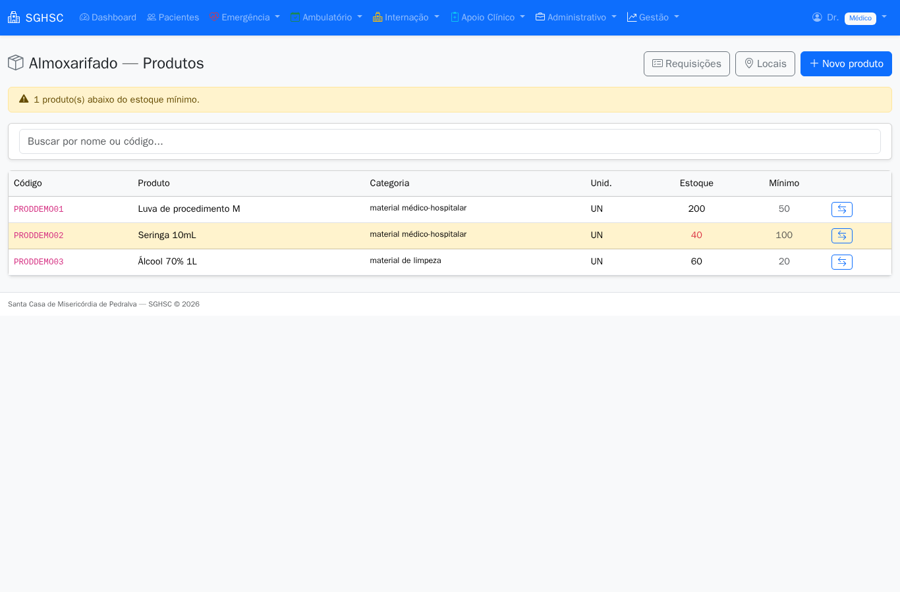

### Compras
- **Fornecedores**: cadastro básico.
- **Solicitações → Pedidos → Recebimento**. Ao registrar o recebimento de um pedido, o **estoque é atualizado automaticamente**.

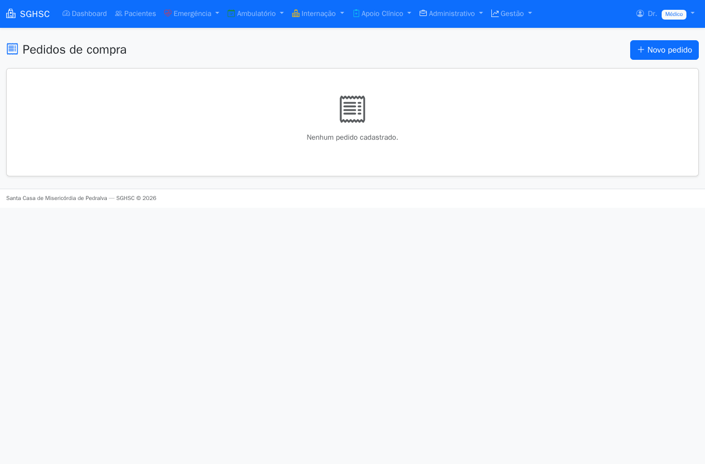

### Financeiro
- **Contas**: cadastre contas a pagar e a receber com vencimento. Use **Baixar** para quitar — isso lança automaticamente no fluxo de caixa.
- **Caixa**: mostra entradas, saídas e saldo.

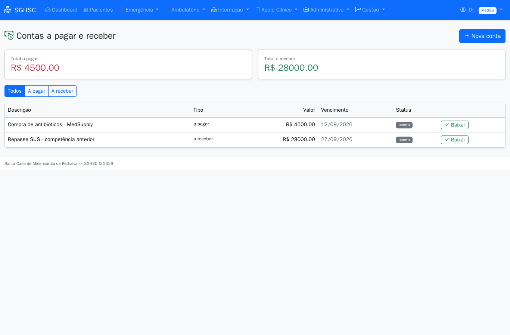

### Faturamento SUS
- Crie **guias** AIH/APAC/BPA com procedimentos e competência. Cadastre procedimentos SIGTAP.
- *A exportação no formato magnético oficial do DATASUS depende das tabelas SIGTAP oficiais (pendente).*

### Convênios
- Cadastre operadoras e a tabela CBHPM/TUSS. Gere **guias TISS** de consulta/internação.

### Patrimônio
- Cadastre bens/equipamentos (com valor e vida útil — o sistema calcula a depreciação). Registre movimentações de localização.

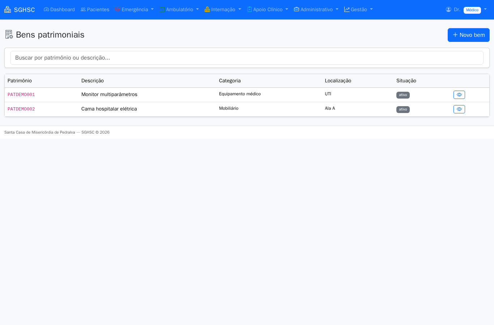

### Recursos Humanos
- Cadastre setores, funcionários e monte as **escalas de plantão**.

### Manutenção
- Abra **ordens de serviço** (corretiva ou preventiva). Acompanhe o status (aberta → em execução → concluída) e registre a solução.

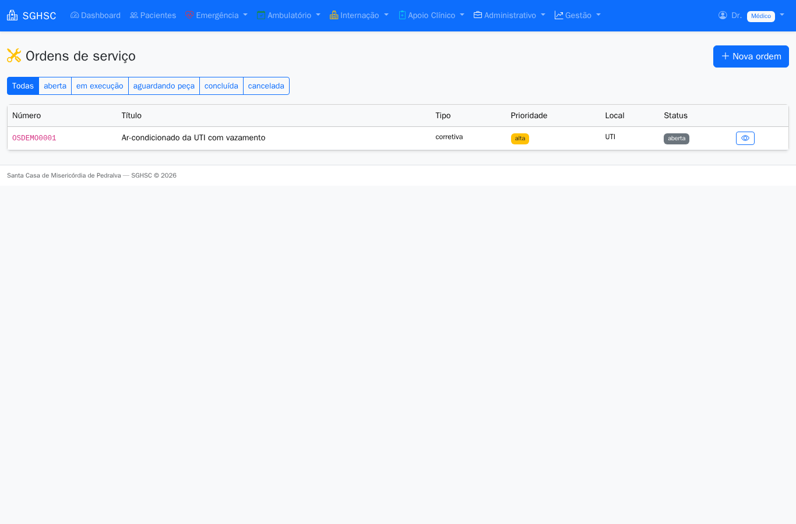

---

## 15. Gestão e Compliance

Acesse pelo menu **Gestão**.

### Dashboard gerencial
- Indicadores consolidados: taxa de ocupação, giro de leitos, média de permanência, altas, produção assistencial. Filtre por período (7/30/90 dias).

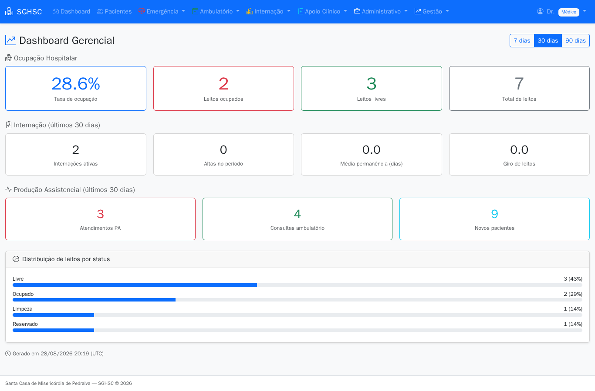

### Resíduos (PGRSS)

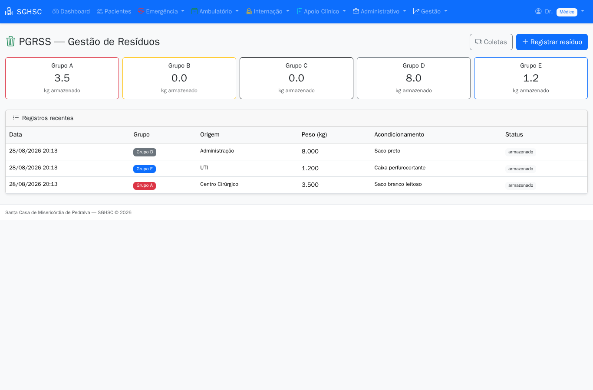

- **Registrar resíduo**: por grupo (A a E, conforme RDC ANVISA), com pesagem.
- **Nova coleta**: consolida os resíduos armazenados numa coleta externa, com manifesto de transporte (MTR) e destinação final.

### RNDS

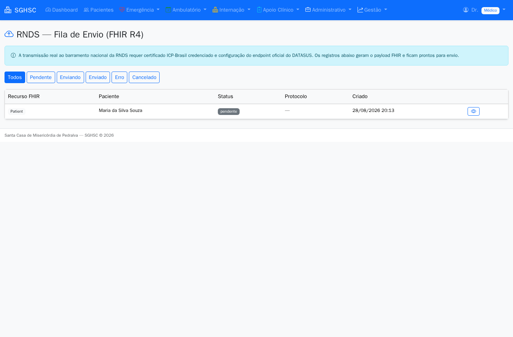

- **Enfileirar paciente**: gera o registro no padrão FHIR R4 para envio à Rede Nacional de Dados em Saúde.
- **Fila**: acompanha o status de cada envio e permite ver o payload FHIR gerado.
- *A transmissão real ao barramento nacional depende de credenciamento no DATASUS (pendente).*

---

## Dúvidas frequentes

**Esqueci minha senha.** Peça a um administrador para redefinir seu acesso.

**Um documento assinado pode ser alterado?** Não. Após a assinatura digital, o
documento é selado; qualquer alteração invalida a assinatura. Para corrigir, gere
um novo documento (ex: uma nova prescrição).

**O sistema funciona sem internet?** Sim, para o uso interno. A internet é necessária
apenas para o carimbo de tempo das assinaturas, o preenchimento automático de endereço
(ViaCEP) e, futuramente, o envio à RNDS.

**Por que meu documento foi assinado "sem carimbo de tempo"?** O servidor de carimbo
de tempo (TSA) estava inacessível no momento. A assinatura continua válida; o carimbo
é um reforço antifraude que exige conexão externa.
